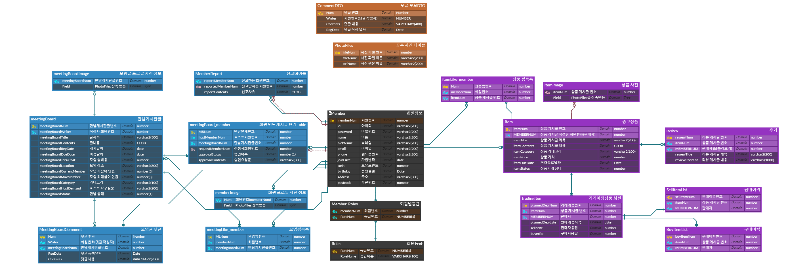

    

    <strong>중고거래와 모임 웹사이트 📦👥</strong>

## Features

구디마켓 기능을 소개합니다.
~~~~~~~~~~~~~~~~~~
[ 중고거래📦 ]
1. 판매, 후기
2. 마이페이지

[ 모임👥 ]
1. 모임글 게시, 모임 참여, 신고
2. 마이페이지
~~~~~~~~~~~~~~~~~~

## Member 
~~~~~~~~~~~~~~~~~~
김남진, 권경문, 안다은, 서소영
~~~~~~~~~~~~~~~~~~

## Contributors Wall

## Work Flow

## ERD

